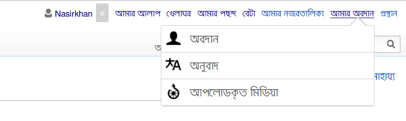
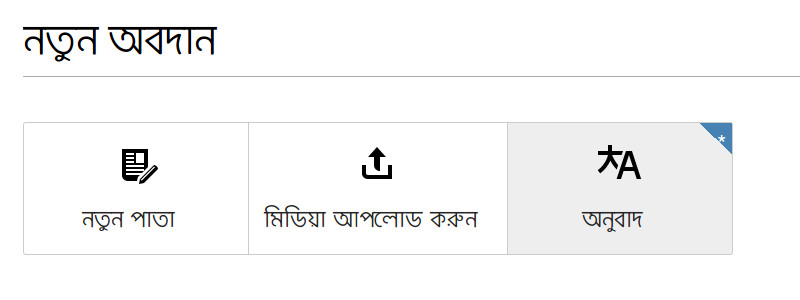
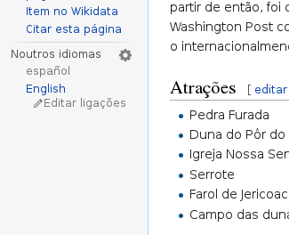

## অনুবাদ ড্যাশবোর্ড

ড্যাশবোর্ড থেকে অনুবাদের সকল কাজ নিয়ন্ত্রণ করা যায়।

### ড্যাশবোর্ড পরিচিতি

ড্যাশবোর্ড ওপেন করার চারটি পদ্ধতি রয়েছে:

**প্রথম পদ্ধতি**, লগইন করার পর মাউস পয়েন্টারটি স্ক্রিনের উপরের ডান দিকের টুলবারের "অবদান" এর উপরে আনুন। একটি সাবমেনু দেখা যাবে যেখান থেকে "অনুবাদ" ক্লিক করুন।

**দ্বিতীয় পদ্ধতি**, মেনু থেকে "অবদান" লিংকে ওপেন করুন এবং পাতার উপরের "অনুবাদ" বাটনে ক্লিক করুন।

**তৃতীয় পদ্ধতি**, নির্দিষ্ট ভাষার যে নিবন্ধটি অনুবাদ করতে চান সেটি ঐ ভাষার উইকি থেকে ওপেন করন। এবার আন্তঃউইকি সংযোগ অংশ থেকে যে ভাষায় অনুবাদ করতে চান, সেই ভাষার নামে ক্লিক করুন। (উৎস উইকিতে এই টুল ইনস্টল এবং সক্রিয় থাকলেই কেবলমাত্র এই পদ্ধতিতে অনুবাদ করা যাবে।)

**চতুর্থ পদ্ধতি**, উইকি অনুসন্ধান বক্সে "[Special:CX](https://bn.wikipedia.org/wiki/Special:ContentTranslation)" অথবা "[Special:ContentTranslation](https://bn.wikipedia.org/wiki/Special:ContentTranslation)" লিখে সরাসরি অনুবাদ ড্যাশবোর্ডে ওপেন করা।

