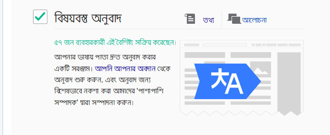

## বিষয়বস্তু অনুবাদ সক্রিয় করা

বর্তমানে বিষয়বস্তু অনুবাদ টুলটি বেটা বৈশিষ্ট হিসাবে ব্যবহার করা যাচ্ছে। আর তাই এটি ব্যবহার করার জন্য পছন্দসমূহ পাতা থেকে এটি সক্রিয় করতে হবে। এটি করার জন্য প্রথমে আপনার অ্যাকাউন্টে লগইন করুন এবং বেটা লিংকে ক্লিক করে বেটা বৈশিষ্টসমূহ পাতা ওপেন করুন এবং বিষয়বস্তু অনুবাদ বৈশিষ্টের পাশে টিক চিহ্ন দিন। এরপর পছন্দসমূহ পাতার সংরক্ষণ বাটনে ক্লিক করুন।

