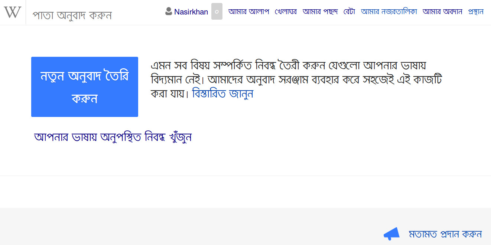

## কন্টেন্ট ট্রান্সলেশন ইন্টারফেস 

### সাধারণ বৈশিষ্ট

- বিষয়শ্রেণীগুলো সয়ংক্রিয়ভাবে অনুবাদিত হতে পারে। উৎস ভাষার বিষয়শ্রেণীর আন্তঃউইকি সংযোগে অনুবাদিত ভাষার সংযোগ থাকলেই কেবলমাত্র এটি সয়ংক্রিয় অনুবাদ হবে।
- উৎস এবং অনুবাদের জন্য আপনি যে ভাষাগুলো নির্বাচন করেছেন সেগুলোর জন্য যান্ত্রিক অনুবাদ কার্যকর থাকে, তবে কোনো অনুচ্ছেদে ক্লিক করা হলে প্রথমে যান্ত্রিক অনুবাদটি দেখানো হবে। যান্ত্রিক অনুবাদ পূর্নাঙ্গ নাও হতে পারে, অনুবাদটি প্রকাশ করার আগে অবশ্যই পর্যালোচনা করা উচিত।
- যদি যান্ত্রিক অনুবাদ সক্রিয় না থাকে, তবে উৎস পাতার লেখা গুলো যুক্ত হবে, এবং লিংকগুলো সয়ংক্রিয়ভাবে অনুবাদ হয়ে যাবে।
- ছবিগুলোতে ক্লিক করেই সেগুলো উৎস নিবন্ধ থেকে অনুবাদিত নিবন্ধে স্থানান্তর করা যাবে। তবে ছবির ক্যাপশনগুলো অনুবাদ করতে হবে (এবং যদি যান্ত্রিক অনুবাদ সক্রিয় থাকে তবে সেটি সয়ংক্রিয় অনুবাদ হবে)।
- তথ্যসূত্রগুলো সয়ংক্রিয়ভাবে গ্রহন করা হবে, তবে প্রকাশের পর উইকির স্টাইল অনুযায়ী কিছু পরিবর্তন করতে হতে পারে।
- ব্লক টেমপ্লেট, যেমন ইনফোবক্স অনুবাদ ইন্টারফেসে দেখা যাবে না। প্রকাশের পর এগুলো যুক্ত করা যাবে। (ভবিষ্যতে এই ধরনের টেমপ্লেটগুলো সয়ংক্রিয় অনুবাদের ব্যবস্থা যুক্ত করা হতে পারে।)

### লেখা এবং প্রকাশ করা

- অনুবাদ কলামে প্রতিটি অনুচ্ছেদ আলাদাভাবে অনুবাদ করতে হবে। পাতার সবগুলো অনুচ্ছেদ অনুবাদ করা বাধ্যতামূলক না - আপনার ভাষার উইকির জন্য যতটা সম্ভব অনুবাদ করুন।
- প্রকাশ করার আগ পর্যন্ত, আপনার সকল অনুবাদ সয়ংক্রিয়ভাবে সংরক্ষিত হতে থাকবে, আপনার অনুবাদ হারিয়ে যাবে এমন ভাবার কোনো কারণ নেই। পুনরায় অনুবাদ শুরু করার জন্য অনুবাদ ড্যাশবোর্ড ওপেন করতে হবে এবং যে পাতাটি পুনরায় শুরু করবেন সেই লিংকে ক্লিক করতে হবে।
- অনুবাদকৃত পাতাটি প্রকাশের উপযোগী মনে হলে "অনুবাদ প্রকাশ করুন" ক্লিক করুন।

### বিভিন্ন ধাপে অনুবাদ করা

আপনি কোনো ভাষার অনুবাদ শুর করলে ড্যাশবোর্ডে সেটি যুক্ত হয়ে যাবে। পরবর্তীতে পুনরায় অনুবার শুরু করতে হলে তালিকা থেকে নির্দিষ্ট নামে ক্লিক করুন।

বর্তমানে কি কি অনুবাদ করছেন সেটি দেখার পাশাপাশি পূর্বে কোন কোন পাতা এই টুল ব্যবহার করে প্রকাশ করা হয়েছে সেটিও দেখার সুযোগ রয়েছে এই ড্যাশবোর্ডে। এটি দেখার জন্য ড্যাশবোর্ড থেকে "অনুবাদ চলছে" এর পরিবর্তে "প্রকাশিত অনুবাদ" নির্বাচন করতে হবে।