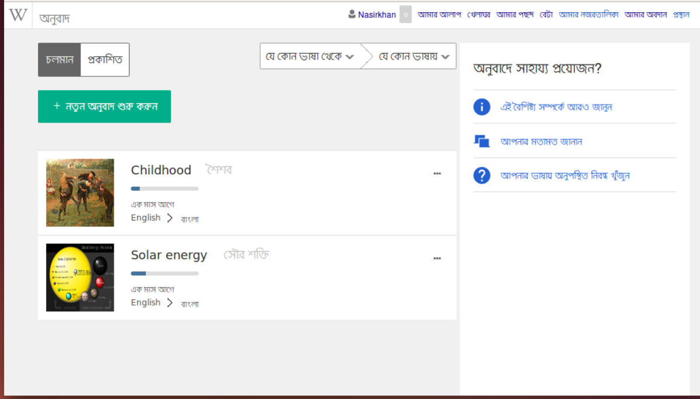

## অনুবাদ শুরু করা

### নতুন অনুবাদ শুরু

নতুন অনুবাদ শুরু করার জন্য নিচের পদ্ধতি অনুসরণ করুন। 

- "নতুন অনুবাদ তৈরি করুন" বাটনটিতে ক্লিক করুন।
- উৎস ভাষা নির্বাচন করুন এবং যে পাতাটি অনুবাদ করতে চান সেটির নাম লিখুন।
- যে ভাষায় অনুবাদ করবে সেটি নির্বাচন করুন এবং অনুবাদিত পাতাটির নাম কি হবে সেটি লিখুন। উৎস এবং অনুবাদিত, দুই ভাষাতেই যদি পাতাটি একই নামে ব্যবহার করতে চান, তবে এই ঘরটি খালি রাখুন।
- "অনুবাদ শুরু করুন" বাটনে ক্লিক করুন!

### পুনরায় অনুবাদ করা

কোনো নিবন্ধ অনুবাদ শুরু করার পরে একবারেই যে সবটুকু অনুবাদ করতে হবে এমন নয়। অনুবাদ শুরু করার পর থেকে অনুবাদের অগ্রগতি সয়ংক্রিয়ভাবে সংরক্ষিত হতে থাকে। ফলে যে কোনো সময় অনুবাদ উইন্ডো বন্ধ করে দেয়া হলেও, পরবর্তীতে যখন সেটি পুনরায় ওপেন করা হবে তখন অনুবাদ ড্যাশবোর্ডে চলমান অনুবাদ নিবন্ধের তালিকায় নিবন্ধটি পাওয়া যাবে। এভাবে বিভিন্ন সময় অনুবাদ করে একটি গ্রহনযোগ্য পরিমান অনুবাদ সম্পন্ন হলে নিবন্ধটি প্রকাশ করা যেতে পারে। 

ভুল, ত্রুটিপূর্ণ অনুবাদ, অথবা অত্যাধিক ছোট নিবন্ধ প্রকাশ করা হলে সেটি গ্রহনযোগ্য হবে না। এবং কখনো কখনো সেটি অপসারণের জন্য তালিকাভুক্ত করা হতে পারে। 
