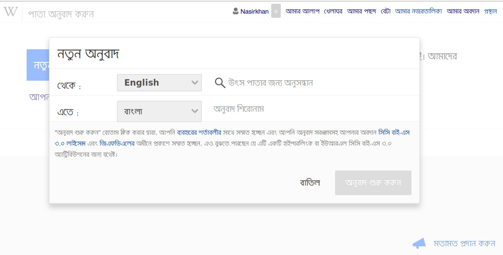

## অনুবাদ শুরু করা

নতুন অনুবাদ শুরু করার জন্য নিচের পদ্ধতি অনুসরণ করুন। 

- "নতুন অনুবাদ তৈরি করুন" বাটনটিতে ক্লিক করুন।
- উৎস ভাষা নির্বাচন করুন এবং যে পাতাটি অনুবাদ করতে চান সেটির নাম লিখুন।
- যে ভাষায় অনুবাদ করবে সেটি নির্বাচন করুন এবং অনুবাদিত পাতাটির নাম কি হবে সেটি লিখুন। উৎস এবং অনুবাদিত, দুই ভাষাতেই যদি পাতাটি একই নামে ব্যবহার করতে চান, তবে এই ঘরটি খালি রাখুন।
- "অনুবাদ শুরু করুন" বাটনে ক্লিক করুন!

