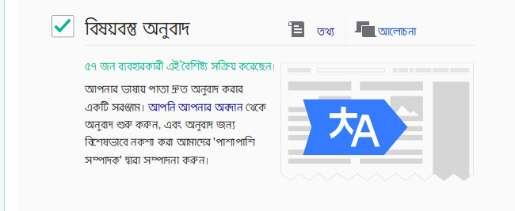

[Content Translation](https://www.mediawiki.org/wiki/ContentTranslation) হলো এমন একটি টুল যার মাধ্যমে সম্পাদকগণ বিভিন্ন পাতা নিজের ভাষায় অনুবাদ করতে পারবেন। এটি ব্যবহার করে অনুবাদকগণ সহজেই অনুবাদিত লেখা যোগ করতে পারবেন এবং ম্যানুয়ান ফরম্যাটিং, বিষয়শ্রেণী যোগ করা, লিংক ও ছবি সংযোজনের মত কাজগুলোর জন্য কম সময় ব্যয় করতে হবে।

উইকিমিডিয়া প্রকল্প সমূহে এক ভাষার নিবন্ধ অন্যান্য ভাষায় অনুবাদ করা খুবই সাধারণ একটি বিষয়। অনুবাদ করে নিবন্ধ তৈরীর সময় লেখার ফরম্যাটিং, লিংক,বিষয়শ্রেণী, তথ্যসূত্র, বিভিন্ন টেমপ্লেট অনুবাদ করা ও সমন্বয় করা প্রয়োজন হয়। 

*বিষয়বস্তু অনুবাদ টুল* এই কাজগুলোই আরও সহজ করে দিচ্ছে। এটি ব্যবহার করে কোনো নিবন্ধ বা পাতার একটি প্রথমিক কাঠামো তৈরী করার জন্য ব্যবহার করা যেতে পারে। প্রথমবার প্রকাশ করার পর অন্যান্য উইকি পাতার মতই সাধারণ পদ্ধতিতে সম্পাদনা করা যাবে। 

## বিষয়বস্তু অনুবাদ সক্রিয় করা

বর্তমানে বিষয়বস্তু অনুবাদ টুলটি বেটা বৈশিষ্ট হিসাবে ব্যবহার করা যাচ্ছে। আর তাই এটি ব্যবহার করার জন্য পছন্দসমূহ পাতা থেকে এটি সক্রিয় করতে হবে। এটি করার জন্য প্রথমে আপনার অ্যাকাউন্টে লগইন করুন এবং বেটা লিংকে ক্লিক করে বেটা বৈশিষ্টসমূহ পাতা ওপেন করুন এবং বিষয়বস্তু অনুবাদ বৈশিষ্টের পাশে টিক চিহ্ন দিন। এরপর পছন্দসমূহ পাতার সংরক্ষণ বাটনে ক্লিক করুন।

