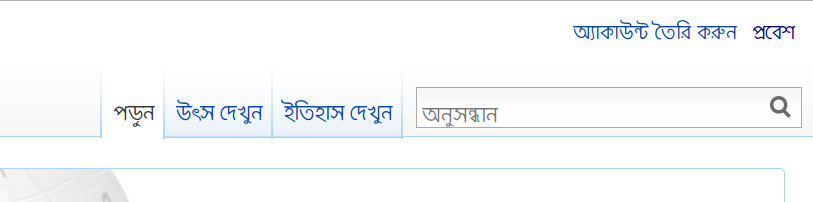

## একাউন্ট তৈরী করা প্রয়োজন কেন

 

সবসময়ই উইকিপিডিয়া ব্যবহারকারীদের নিবন্ধন করার জন্য উৎসাহিত করা হয়ে থাকে। এখানে খুব সহজেই বিনামূল্যে এবং কোন ঝামেলা ছাড়াই অ্যাকাউন্ট তৈরী করা যায় এবং সেই সাথে নিবন্ধিত ব্যবহারকরীরা এখানে বিশেষ কিছু সুবিধা পেয়ে থাকেন। উইকিপিডিয়াতে অ্যাকাউন্ট তৈরী করা হলে অন্যান্য উইকিপিডিয়ানরা সহজেই ঐ ব্যবহারকারীর  সাথে যোগাযোগ করতে পারবেন।

* নিবন্ধিত ব্যবহারকারীর একটি ব্যবহারকারী পাতা [http://bn.wikipedia.org/wiki/WP:USER](http://bn.wikipedia.org/wiki/WP:USER) এবং আলাপ পাতা [http://bn.wikipedia.org/wiki/WP:TALKPAGE](http://bn.wikipedia.org/wiki/WP:TALKPAGE) পাবেন। নিজের সম্পর্কে বিভিন্ন তথ্য যুক্ত করে এবং অন্যান্য ব্যবহারকারীদের সাথে যোগাযোগ করার জন্য এই পাতাগুলো ব্যবহার করা হয়।
* প্রয়োজন অনুযায়ী বিভিন্ন পাতা “নজর তালিকা”-য় [http://bn.wikipedia.org/wiki/Special:Watchlist](http://bn.wikipedia.org/wiki/Special:Watchlist) রেখে নিয়মিত পর্যবেক্ষন করা যাবে
* রেজিস্ট্রেশনের সময় ইমেইল ঠিকানা দেয়া হলে অন্যান্য ব্যবহারকারীরা সহজেই ইমেইলের মাধ্যমে সাথে যোগাযোগ করতে পারবেন। প্রয়োজনে ইমেইল ঠিকানা গোপন রেখেও যোগাযোগ করা যাবে।
* নিবন্ধিত ব্যবহারকারীরা বিভিন্ন আলোচনায় বিশেষ গুরুত্ব পেয়ে থাকেন
* পছন্দমতো সেটিংস পরিবর্তন করার সুযোগ পাওয়া যায়
* থিম পরিবর্তন এবং ফন্ট, লেআউট সহ অন্যান্য অপশন পরিবর্তনের সুযোগ পাওয়া যাবে
* মিডিয়াউইকি সফটওয়্যারটি  উইকিপিডিয়ার সকল পরিবর্তনসমূহ সংরক্ষন করে থাকে। অ্যাকাউন্ট তৈরী করা থাকলে পাতার সম্পাদনা ইতিহাস পাতায় আপনার ব্যবহারকারী  নাম লেখা থাকে। অন্যথায় ব্যবহারকারীর কম্পিউটারের আইপি ঠিকানা উল্লেখ করা থাকে । আইপি ঠিকানা সমূহ প্রতিনিয়ত পরিবর্ত হয় ফলে নিয়মিত অবদান রাখলেও পরবর্তীতে ঐ ব্যবহারকারীকে খুজে পাওয়া যায় না। অ্যাকাউন্ট ছাড়া যোগাযোগ করার অন্যা কোন পদ্ধতি নেই, তাই হয়তো পুরষ্কার দেয়ার ইচ্ছা থাকলেও তার সাথে যোগাযোগ করা সম্ভব হবে না।

সব থেকে গুরুত্বপূর্ণ বিষয় হল নিবন্ধিত ব্যবহারকারীরাই কেবলমাত্র উইকিপিডিয়াতে নতুন নিবন্ধ তৈরী করার সুযোগ পাবেন। এছাড়া বিশেষ কিছু পাতা রয়েছে যেগুলি সম্পাদনার জন্য নিবন্ধ প্রয়োজন। সেই সাথে নিবন্ধন করার পর সম্পাদনা করার জন্য বিশেষ কিছু টুল ব্যবহার করা যাবে।

উইকিপিডিয়াতে নতুন অ্যাকাউন্ট খুলতে হলে [http://bn.wikipedia.org/wiki/Special:Userlogin](http://bn.wikipedia.org/wiki/Special:Userlogin)  এই পাতা থেকে "নতুন একাউন্ট খুলুন" এই লিংকে ক্লিক করতে হবে। অথবা সরাসরি [http://bn.wikipedia.org/w/index.php?title=Special:Userlogin&type=signup](http://bn.wikipedia.org/w/index.php?title=Special:Userlogin&type=signup) লিংক থেকেও উইকিপিডিয়াতে নতুন অ্যাকাউন্ট তৈরী করা যাবে। এছাড়া উইকিপিডিয়ার যে কোন পাতার উপরের ডান পাশে _অ্যাকাউন্ট তৈরি করুন/ প্রবেশ_ নামের একটি লিংকটি ব্যবহার করে নিবন্ধন করা যাবে। অ্যাকাউন্ট তৈরী করার সময় যে কোন পছন্দের নাম ব্যবহার করা যাবে। তবে একবার অ্যাকাউন্ট তৈরী করা হয়ে গেলে সহজে সেটি আর পরিবর্তন করা যাবে না। নিবন্ধনের সময় একটি ইমেইল ঠিকানা ব্যবহার করতে হবে। প্রয়োজন অনুযায়ী বিভিন্ন ধরনের নোটিফিকেশন পাঠানো এবং সরাসরি যোগাযোগ করার জন্য ব্যবহার করা হয় এই ঠিকানাটি। অ্যাকাউন্ট তৈরী করার পর [http://bn.wikipedia.org/wiki/Special:Preferences](http://bn.wikipedia.org/wiki/Special:Preferences)  ঠিকানা থেকে ব্যবহারকারী তার পছন্দ অনুযায়ী বিভিন্ন অপশন পরিবর্তন করতে পারবেন।

