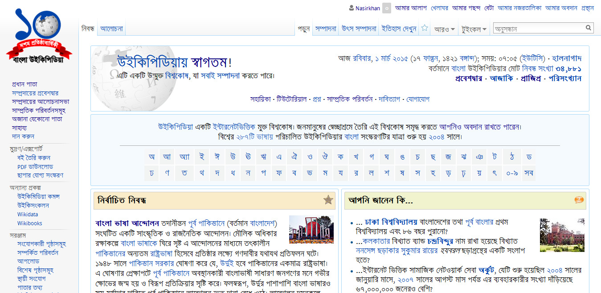

## প্রধান পাতা

বাংলা উইকিপিডিয়ার প্রথম পাতাটিকে বলা হয় *প্রধান পাতা*। [http://bn.wikipedia.org](http://bn.wikipedia.org) থেকে বাংলা উইকিপিডিয়া ব্যবহার করা যায়। প্রধান পাতাটি ব্যবহারকারীদের সুবিধার্থে বিশেষ কতগুলি অংশে ভাগ করা হয়েছে।

**নির্বাচিত নিবন্ধ**

উইকিপিডিয়ার নিবন্ধগুলোর মান যাচাই এর বেশ কিছু পদ্ধতি রয়েছে। এর পদ্ধতি অনুযায়ী যাচাই করার পরে নিবন্ধগুলোকে 'নির্বাচিত নিবন্ধ', 'ভালো নিবন্ধ' ইত্যাদি ভাগে চিহ্নিত করা হয়। উইকিপিডিয়ার সব থেকে মানসম্পন্ন নিবন্ধগুলোকে বলা হয় *নির্বাচিত নিবন্ধ*। প্রধান পাতার এই অংশে প্রতিদিন একটি করে *নির্বাচিত নিবন্ধ* রাখা হয়। নির্বাচিত নিবন্ধগুলো "[নির্বাচিত নিবন্ধ](https://bn.wikipedia.org/wiki/%E0%A6%AC%E0%A6%BF%E0%A6%B7%E0%A6%AF%E0%A6%BC%E0%A6%B6%E0%A7%8D%E0%A6%B0%E0%A7%87%E0%A6%A3%E0%A7%80:%E0%A6%A8%E0%A6%BF%E0%A6%B0%E0%A7%8D%E0%A6%AC%E0%A6%BE%E0%A6%9A%E0%A6%BF%E0%A6%A4_%E0%A6%A8%E0%A6%BF%E0%A6%AC%E0%A6%A8%E0%A7%8D%E0%A6%A7)" নামের একটি বিশেষ বিষয়শ্রেণীর অধিনে তালিকাভুক্ত করা হয়। 

**আপনি জানেন কি...**

উইকিপিডিয়ার বিভিন্ন নিবন্ধের বিস্ময়কর তথ্যগুলো দিয়ে সাজানো হয় এই *আপনি জানেন কি...* অংশটি। এই অংশের তথ্যগুলো প্রতি সপ্তাহে পরিবর্তন করা করা হয়। নির্বাচিত নিবন্ধ তৈরী করতে হলে যেমন নিবন্ধের একটি বিশেষ মান অর্জন করতে হয়, *আপনি জানেন কি...* অংশের জন্য নিবন্ধগুলোকে সেই বিশেষ মান যাচাই এর বিশেষ পদ্ধতির মধ্য দিয়ে আসতে হয় না। নিবন্ধের কোনো অংশে বিস্ময়কর তথ্য থাকলেই সেটি এখানে তালিকাভুক্ত করার জন্য যোগ্যতা অর্জন করলো। তবে অত্যাধিক ছোটো নিবন্ধগুলো এখানে ব্যবহার করা যায় না।