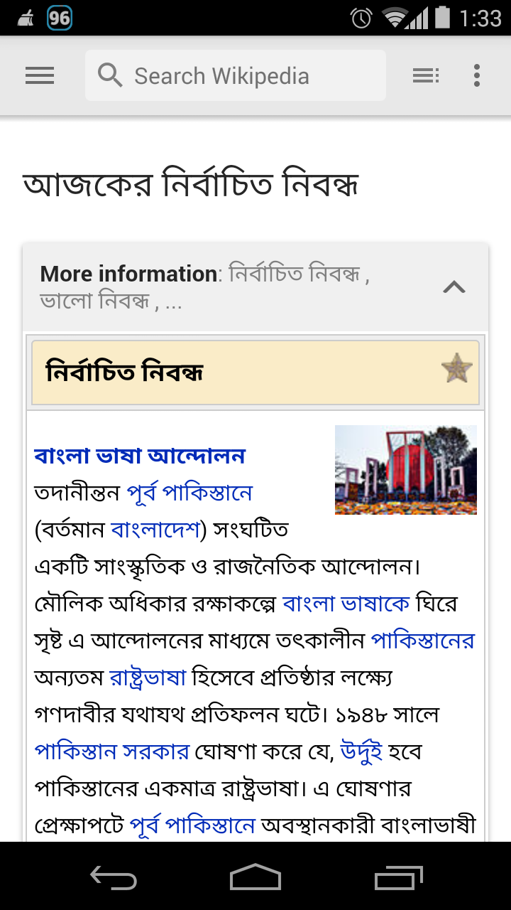

## উইকিপিডিয়া মোবাইল অ্যাপ ব্যবহার পদ্ধতি

উইকিপিডিয়া মোবাইল অ্যাপ চালু করলে প্রথমেই এটি উইকিপিডিয়ার প্রধান পাতা প্রদর্শন করবে। মোবাইলের ডিফল্ট ভাষা যেটি নির্ধারণ করা থাকবে, সেই ভাষার উইকিপিডিয়ার প্রধান পাতা ওপেন হবে, পাশাপাশি অ্যাপের ভাষাও ফোনের ডিফল্ট ভাষা অনুযায়ী হয়ে থাকে।  তবে অ্যাপ সেটিংস থেকে এটি পরিবর্তন করার সুযোগ রয়েছে। 

