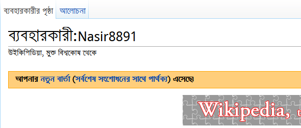

## উইকিপিডিয়ানদের পারস্পরিক যোগাযোগ

উইকিপিডিয়া হল ব্যবহারকারীদের সম্মেলিত প্রচেষ্টায় তৈরী করা একটি বিশ্বকোষ। আর এই কারণে পরস্পরের সাথে যোগাযোগ একটি অত্যন্ত গুরুত্বপূর্ণ বিষয়। কোন নিবন্ধ সম্পাদনা করা, নতুন প্রকল্প তৈরী করা মত উইকিপিডিয়ার বিভিন্ন কাজ করার জন্য পরস্পরের সাথে আলোচনার মাধ্যমে সিদ্ধান্ত নেওয়ার প্রয়োজন হয়। 

এখানে ব্যবহারকারীদের সাথে যোগাযোগ রক্ষার জন্য বেশ কয়েকটি পদ্ধতি প্রচলিত রয়েছে। মূলত “আলাপ পাতা”- এর মাধ্যমেই সাধারণ আলোচনা করা হয়ে থাকে। উইকিপিডিয়ার সম্প্রদায়ের সদস্যদের সাথে সরাসরি আলোচনা করা যাবে "[সম্প্রদায়ের আলোচনাসভায়](https://bn.wikipedia.org/wiki/উইকিপিডিয়া:আলোচনাসভা)"। বিশেষ কোনো বিষয়ে প্রশাসকদের মতামত বা সাহায্য প্রয়োজন হলে "[প্রশাসকদের আলোচনাসভা](https://bn.wikipedia.org/wiki/উইকিপিডিয়া:প্রশাসকদের আলোচনাসভা)" পাতার মাধ্যমে যোগাযোগ করা যেতে পারে। এছাড়া সরাসরি নির্দিষ্ট কোনো প্রশাসকের সাথে আলোচনা করার জন্য তার ব্যক্তিগত আলাপ পাতাও ব্যবহার করা যেতে পারে। পাশাপাশি মেইলিং লিস্ট, আইআরসি চ্যানেল এবং সরাসরি স্বাক্ষাতের মাধ্যমেও পারস্পরিক যোগাযোগ বাড়ানো যেতে পারে। 

### ব্যবহারকারী আলাপ পাতা

যোগাযোগের জন্য সবথেকে সহজ ও কার্যকর পদ্ধতিটি হল আলাপ পাতা ব্যবহার করা। আপনি যদি উইকিপিডিয়াতে নিবন্ধন করে থাকেন, তবে আলাপ পাতা ব্যবহারের এই বিশেষ সুবিধাটি আপনি পাবেন। নিজের আলাপ পাতা দেখা ও ব্যবহারের জন্য লগ ইন করার পর স্ক্রিনের উপরে আমার আলাপ পাতায় ক্লিক করুন। পাতাটি তৈরি করা না থাকলে তৈরি করে নিতে পারেন। তবে উইকিপিডিয়ায় একাউণ্ট তৈরির পরপরই মূলত আগের কোন ব্যবহারকারী আপনাকে স্বাগত জানানোর মাধ্যমে আপনার আলাপ পাতাটি তৈরি করে দেন। পরে যখন আপনি লগ ইন করে আপনার একাউণ্টে প্রবেশ করবেন তখন নিচের মত একটি বার্তা দেখতে পাবেন:

এছাড়া আপনি অন্য কোন ব্যবহারকারীকে কিছু জিজ্ঞাস করতে  সরাসরি তার আলাপ পাতায় আলাপ পাতায়ও কোন কিছু জিজ্ঞাসা করতে পারেন। ধরুন আপনি ব্যবহারকারী  ক এর কাছে কিছু জানতে চাইছেন, এ জন্য আপনি ব্যবহারকারী আলাপ:ক লিখে চল বাটনে ক্লিক করে তার আলাপ পাতায় যান। এবারে তার আলাপ পাতার শেষে আপনার সমস্যাটি উল্লেখ করুন এবং সমস্যাটির শেষে চারটি টিল্ডা (`~`) যোগ করুন। এর ফলে স্বয়ংক্রিয়ভাবে আপনার নাম ও তারিখ সমস্যাটির বর্ণনার শেষে যুক্ত হয়ে যাবে। এখন ঐ ব্যবহারকারী যখন লগ ইন করবেন, তখন তিনি আপনার সমস্যাটি দেখে আপনার আলাপ পাতায় তার সমাধান দিয়ে দেবেন।
